# 1.Github Repo Link

https://github.com/Johnspeanut/cs6650Assignment2

# 2. Description of Server Design

## 2.1 Overview

The server uses Tomcat for executing http request and RabbitMQ for message container. As long as a post request is received, the server will validate the url path as first. If the path is valid, a message object will be constructed based on `LiftRide`. The server then pushes the message object to RabbitMQ queue, where the consumer will pull messsages from it. 

## 2.2 Server package

### 2.2.1 `SkierServlet` class
This class extends `HttpServlet` and aims to process post requests from client side and push messages to RabmitMQ queue. Creating connections are heavy workloads. In my case,connections are created in `init()` method so that it does not bother to generate them when calling `doPost()` method. Also, the class includes `isUrlValid()`, `isValidSkierLiftUrl()` to validate the http request.

### 2.2.2 `LiftRide`
This class is to encapsulate a lift ride record. It includes constructor, get methods, and set methods.

### 2.2.3 `LiftRideRequest`
This class is to encapsulate a lift ride request record. It includes constructor, get methods, and set methods.

## 2.3 Consumer package
It only includes `Main` class. The message information is saved in a `ConcurrentHashMap`.

## 2.4 Client package
This package incorporates `Counter`, `LiftRideRequest`, `Main`,`Phase`, and `UpicHttpClient` classes. The package aims to send http request to Tomcat promptly. 

# 3. Test Runs

## 3.1 64-Threads in client

*   number of Tomcat servers: 1
*   number of channels in each Tomcat server: 64
*   number of threads in the consumer: 128
*   basicQos for each channel in consumer: 10

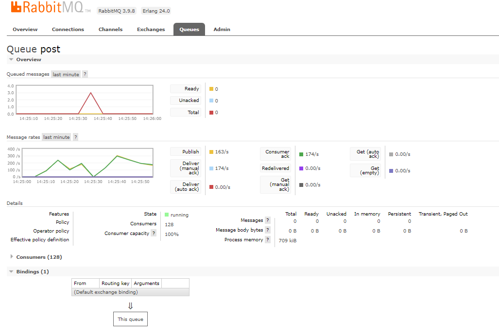

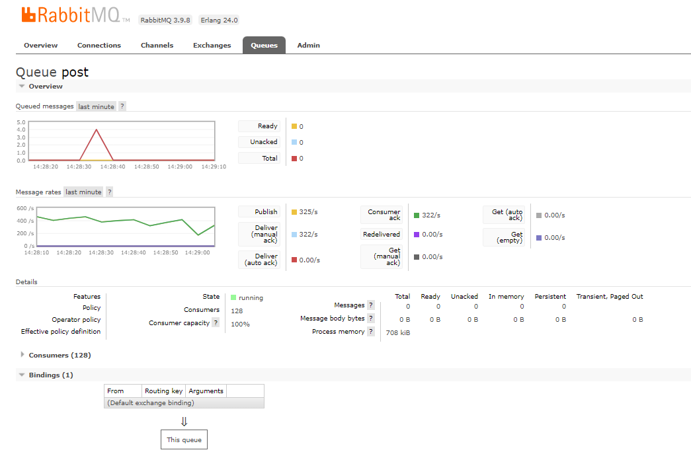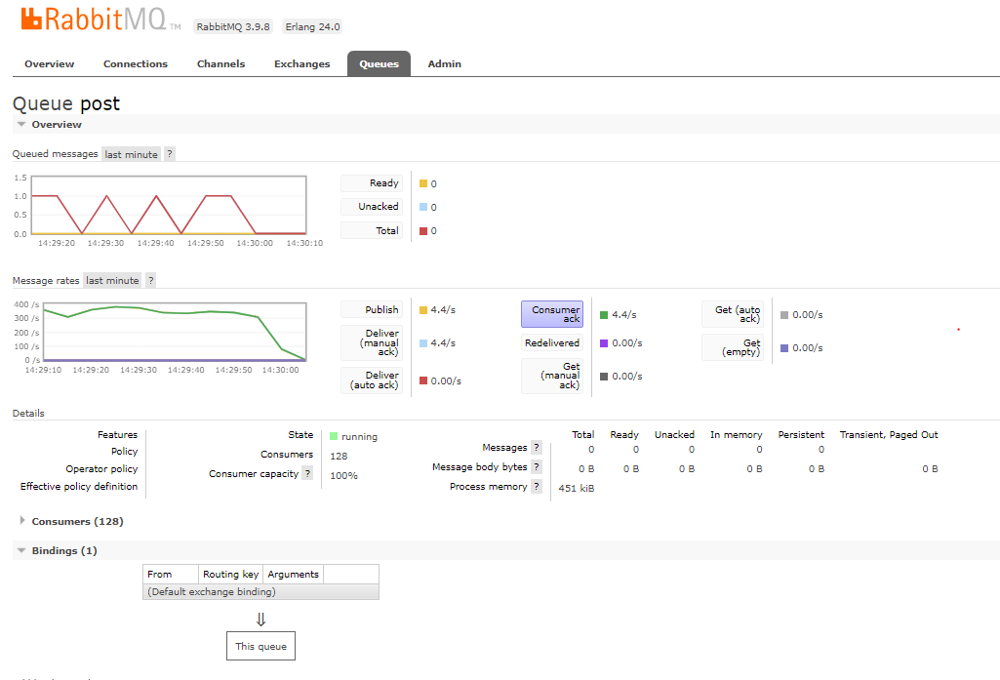

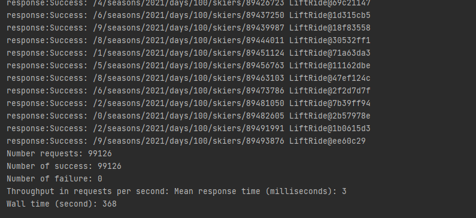

## 3.2 128-Threads in client

*   number of Tomcat servers: 1
*   number of channels in each Tomcat server: 64
*   number of threads in the consumer: 128
*   basicQos for each channel in consumer: 10

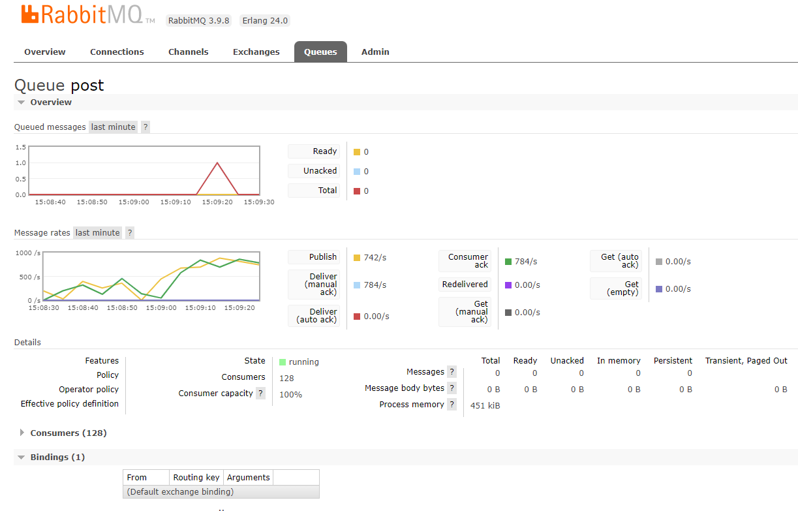

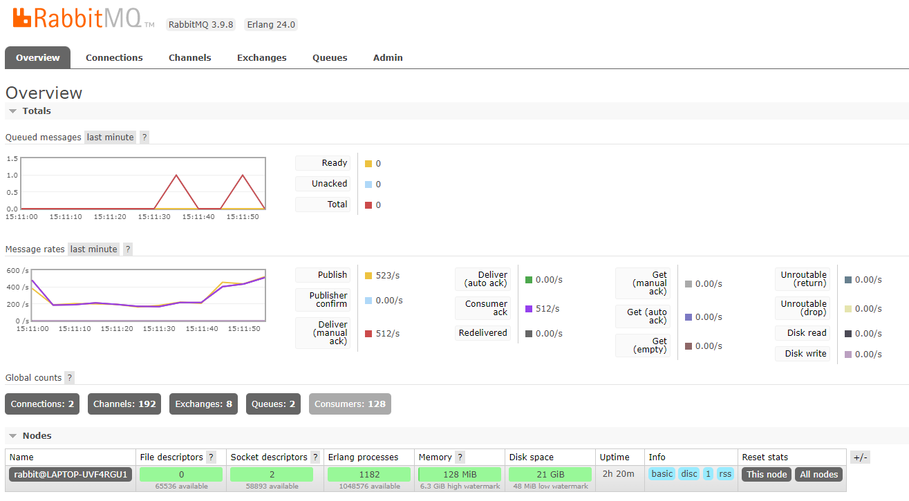

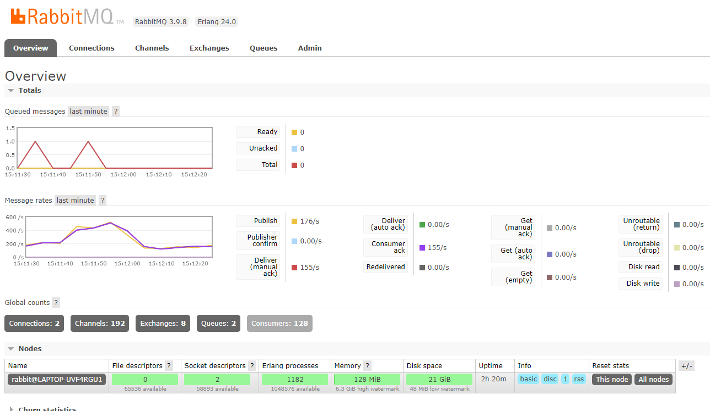

## 3.3 256-Threads in client

*   number of Tomcat servers: 1
*   number of channels in each Tomcat server: 64
*   number of threads in the consumer: 128
*   basicQos for each channel in consumer: 10

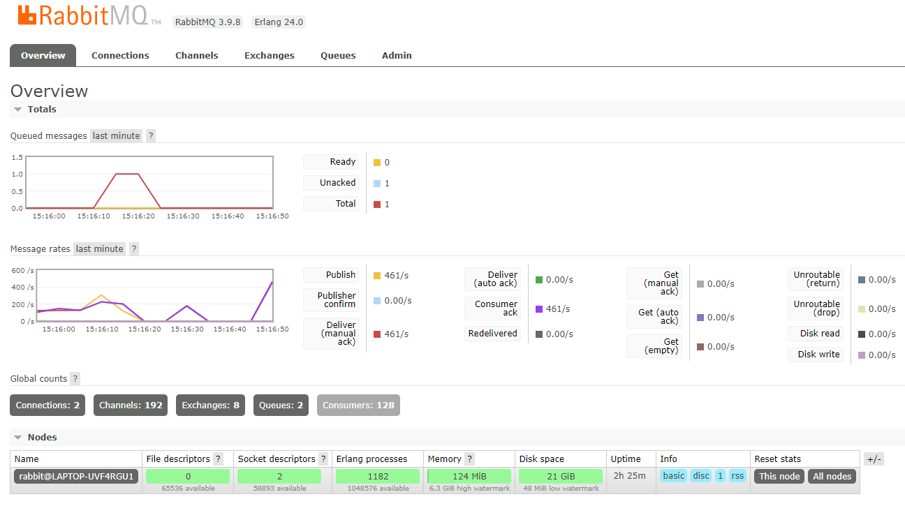

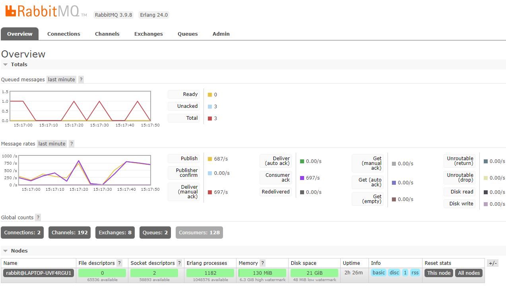

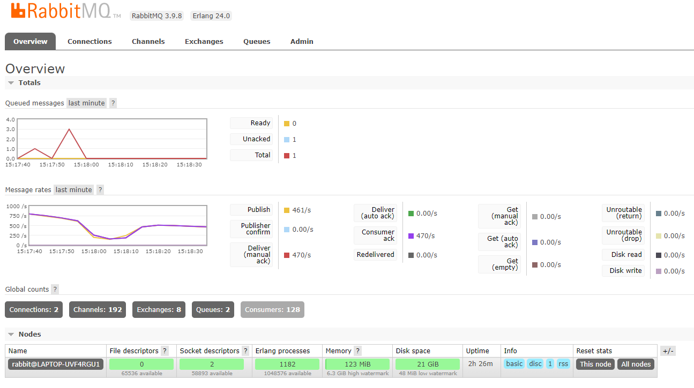

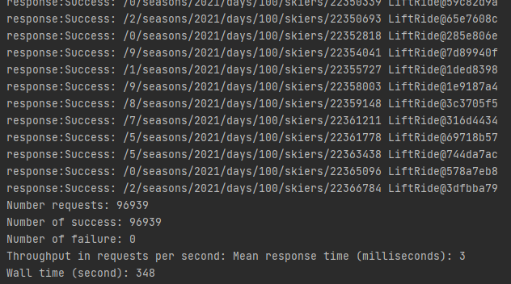

# 4. Bonus Points
## 4.1 512-threads in client test run

*   number of Tomcat servers: 1
*   number of channels in each Tomcat server: 64
*   number of threads in the consumer: 256
*   basicQos for each channel in consumer: 10

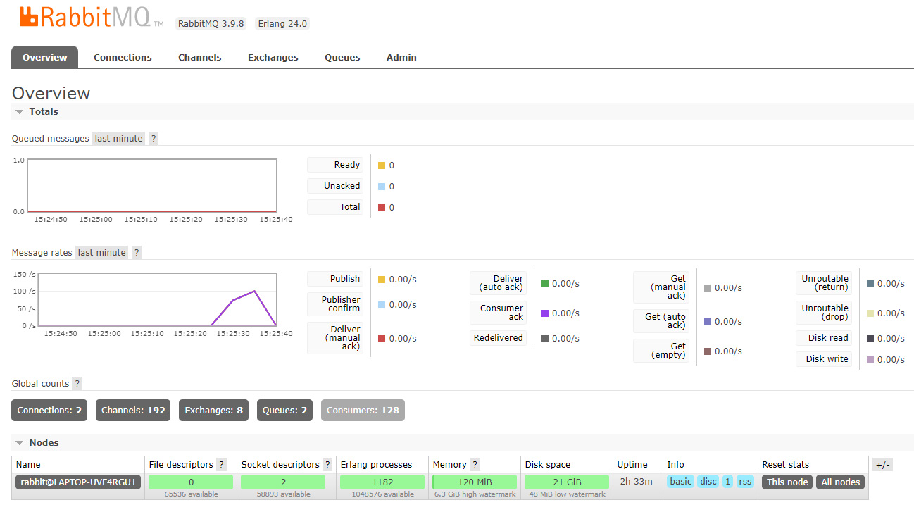

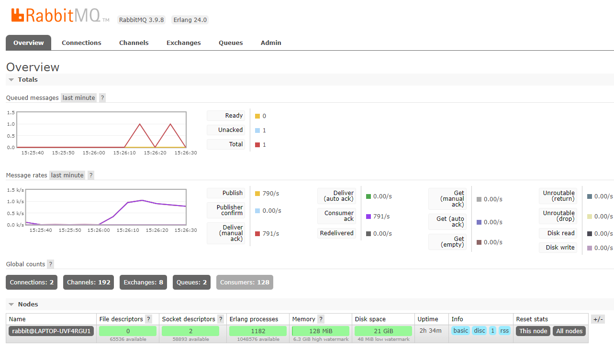

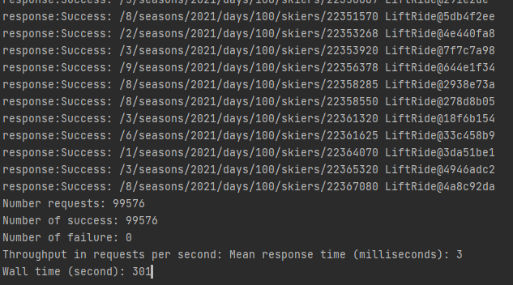